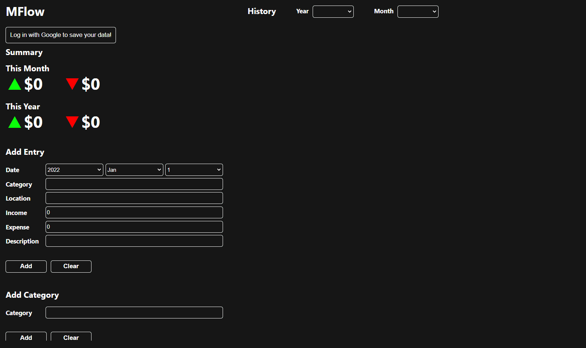

# MFlow (Money Flow)
A spreadsheet-like web app used for tracking income and expense.\
Features Sign in with Google to save data to your Google Drive.\
Available at https://mflow24.herokuapp.com/

## How to Use
1. Sign in with Google first so the entires are saved.
2. Input data into each field you want under "Add Entry" and use to "Add" button to add. 

### Symbol Meanings
▲ : means income\
▼ : means expense

### Deleting Entires
- Hover over the entry in the table that you want to delete, and press the "x" button to delete it. 

### Deleting Category
- Hover over the category name in the table that you want to delete, and press the "x" button to delete it. 
- WARNING: deleting a category deletes all entires in the year that belongs to that category. 

### Notes
- Once you signed in with Google, it will auto sign in into the same account and fetch data from drive next time you visit the site. 
- Under "Add Entry", the field Category, Location, Income, and Expense are mandatory. Category and Location can be anything thats not whitespace. Income and Expense only accepts numbers. 
- You can only add an entry if either income = 0 and expense > 0 or income > 0 and expense = 0 
- The "Add Category" section is optional. You do not need to first add a category then add a entry to that category. "Add Entry" automatically adds a category if the category doesn't exist. 

## Screenshot & Demo

## Libraries Used
[react](https://github.com/facebook/react)\
[react-google-login](https://github.com/anthonyjgrove/react-google-login)\
[express](https://github.com/expressjs/express)\
[googleapis](https://github.com/googleapis/googleapis)\
[simplebar](https://github.com/Grsmto/simplebar)
